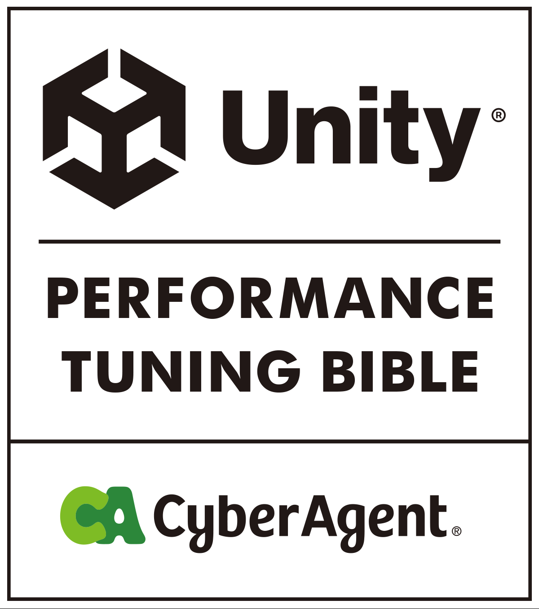
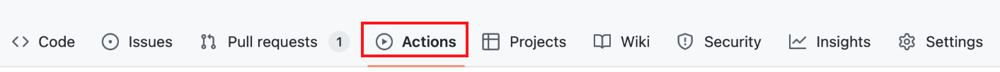
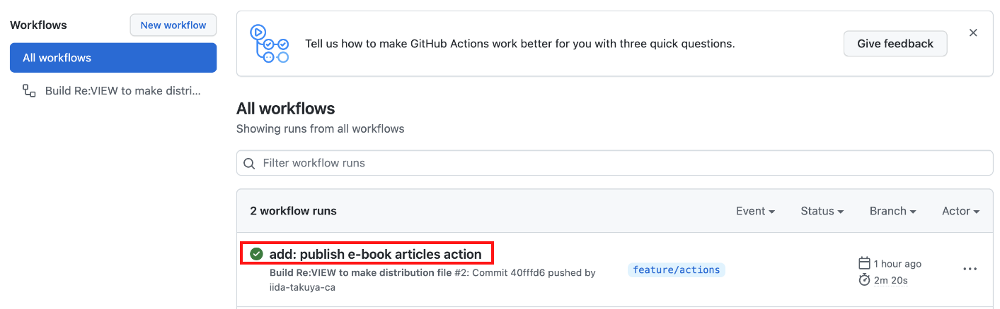
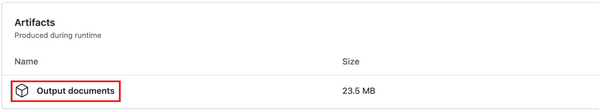

  

# Unity Performance Tuning Bible
本リポジトリはUnityのパフォーマンスチューニングに関するノウハウを、電子書籍として公開するためのプロジェクトです。  
パフォーマンスチューニングを行う際にご活用ください。

## 電子書籍のダウンロード方法
ダウンロードは以下の手順で行います。
1. Actionsを選択します。

  

2. 最新のWorkflowを選択します。

  

3. Artifactsから電子書籍をダウンロードします。

  

## 書籍の内容について
文章に関する校正はPull Requestをご活用ください。  
また、書籍の内容に関する提案などはIssuesをご活用ください。

## Copyright
(C) 2022 CyberAgent, Inc.
