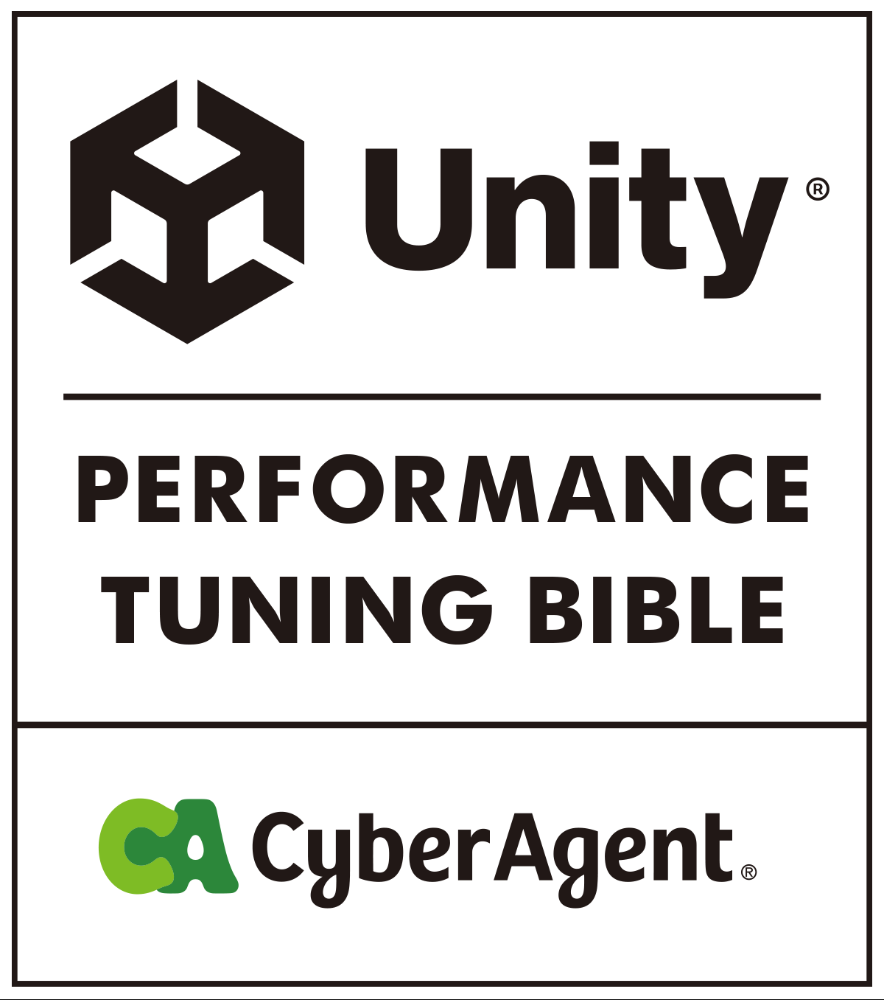

  

# Unity Performance Tuning Bible

**Docs** ([日本語](README.md), [English](README_EN.md))

This book is a systematic collection of Unity performance tuning know-how.  
You can download the e-book as a PDF from this repository.

Please send your comments and suggestions to [Issues](https://github.com/CyberAgentGameEntertainment/UnityPerformanceTuningBible/issues) and [Pull Requests](https://github.com/CyberAgentGameEntertainment/UnityPerformanceTuningBible/pulls).

## About the translated version
### Background
We have received several requests for a translated version of Isseus, but we have decided that it is operationally difficult to release an official translated version, and have decided to leave the translation to each individual user.  
On the other hand, with the background that the quality of translation services is improving, we were examining the possibility of using such services to provide them.  
As a result, we found that it is possible to provide the original text of Re:View Format, including future operations, by translating it using DeepL.  

### Translations other than the English version
Translated versions in other languages are left to the individual.  
The flow to create PDFs in each language is described in [README here](https://github.com/CyberAgentGameEntertainment/UnityPerformanceTuningBible/Un cityPerformanceTuningBible/tree/main/translation).  
By changing the language parameter, the desired translated PDF can be obtained.  

### Note
The quality of the translation depends on the service.  
Please keep in mind that we provide translations based on the assumption that it will be easier than individual translations.

### Updating the translated version
The translated version will be updated when major changes or additions are made, not when typos are made.  

## How to download the e-book.
1. Go to [the latest version of Releases](https://github.com/CyberAgentGameEntertainment/UnityPerformanceTuningBible/releases/latest).

2. Download the PDF from Assets.

## About License
No license is applied to this repository, but copyright laws apply.  
Please refer to the following page for details.

[Licensing a repository > Choosing the right license](https://docs.github.com/en/repositories/managing-your-repositorys-settings-and-features/customizing-your-repository/licensing-a-repository#choosing-the-right-license)

## Copyright
(C) 2022 CyberAgent, Inc.